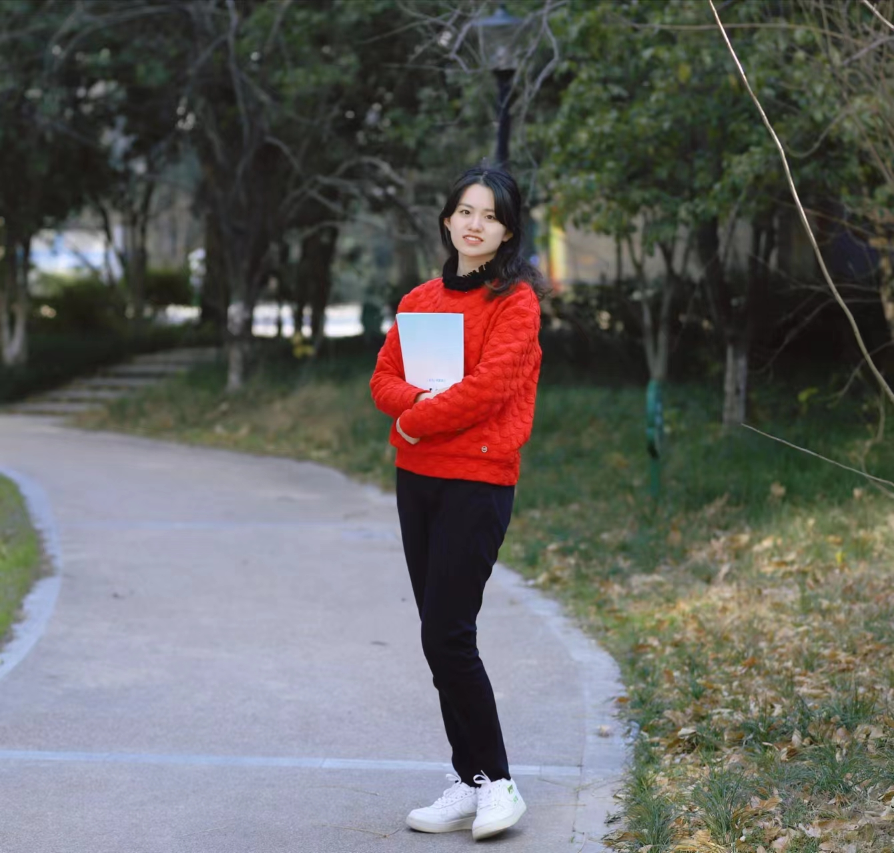

## About Me

Hi! I am a junior year student of B.E. Biomedical Informatics at Zhejiang University-University of Edinburgh Institute, China.
I studied at International campus of Zhejiang University, where all of my professional courses were exclusively taught in English.

## Research Interest

To be filled.

## Skills
Category | Item
-----|-------
Programming | Python (favourite), R, Linux (still learning)
Tool | MySQL, Git, Latex, Adobe Audition, Adobe Photoshop (a little)
Language | Mandarin, English: IELTS 7
Hobby | Singing, broadcasting and hosting，Piano, Dancing

## Student Positions
* 2020.9-present: League branch secretary
* 2021.9-2022.9: Deputy Director of Organization Department of Youth League Committee of International Campus
* 2021.9-2022.9: Head of Zhejiang university international campus novel sound broadcasting club

## Honors

Year | Honor 
-----|-------
2020-2021 & 2021-2022 | National Scholarship 
2020-2021 & 2021-2022 | Zhejiang University Scholarship - First Prize
2021-2022 | Outstanding League Leader of Zhejiang University
2021-2022 | Academic excellence model, Social work model
2020-2021 | A model for cultural and sports activities, 

## Competitions

Year | Competition | Rank
-----|---------------|--------
2022 | The 8h China International College Students ‘Internet+’ Innovation and Entrepreneurship Competition | Gold Award 
2021 | Zhejiang University Choral Competition | First prize 
2021 | Singing competition of International Campus | Top 9th
2021 | Social Practice Evaluation of International Campus in 2021 Winter Vacation | Second prize 

---
## Major Research experience

> **Student Research Training Program**: Benchmarking RNA velocity bioinformatics tools
> Team leader

> Supervisor: [Wanlu Liu](https://labw.org/) *Assistant Professor, ZJU-UoE institute, Zhejiang University* 

> Time: Mar. 2022 - present

